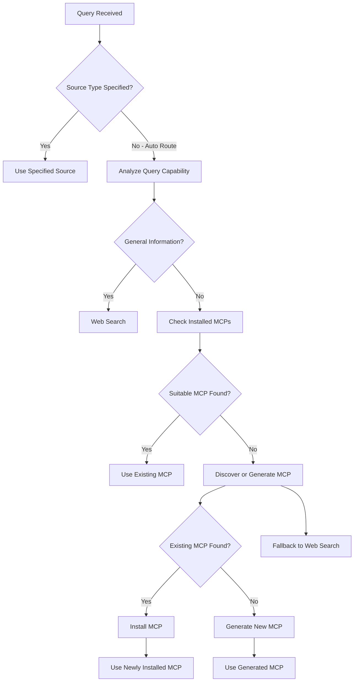

# MCP Workflow Guide

This document explains how the integrated MCP ecosystem works within the Oracle agent, providing intelligent routing and dynamic capability acquisition.

## Overview

The Oracle agent now features an enhanced workflow that seamlessly integrates web search capabilities with MCP (Model Context Protocol) tools. This allows the system to:

1. Automatically route queries to the most appropriate knowledge source
2. Dynamically discover, install, and generate MCP servers as needed
3. Gracefully degrade to web search when specialized capabilities aren't available

## Query Routing Decision Tree

When a query is received, the Oracle follows this decision tree:



## Workflow Paths

### 1. Direct Web Search
For general information queries identified by keywords like "what", "who", "when", "where", "why", "how", the system performs a direct web search.

### 2. Using Existing MCPs
When a query requires specialized capabilities and a suitable MCP is already installed, the Oracle directly executes the appropriate MCP tool.

### 3. Discovering and Installing MCPs
If no suitable MCP is installed, the Oracle:
1. Searches for existing MCPs in registries
2. Filters by trust score (minimum 80.0)
3. Installs the most suitable MCP
4. Executes the query using the newly installed MCP

### 4. Generating New MCPs
If no existing MCP meets the requirements:
1. The Oracle generates a new MCP tailored to the capability
2. Automatically installs the generated MCP
3. Executes the query using the new MCP

### 5. Fallback Mechanism
If any step fails, the system gracefully falls back to web search.

## Configuration Requirements

To enable the full MCP workflow, ensure:

1. Proper MCP configuration in `.kiro/settings/mcp.json`
2. Network access to MCP registries
3. Appropriate permissions for installing MCP servers
4. Sufficient disk space for MCP installations

## Troubleshooting Common Issues

### MCP Installation Failures
- Check network connectivity to package repositories
- Verify sufficient disk space
- Ensure proper permissions for installation directories

### MCP Execution Errors
- Verify MCP server is properly installed and configured
- Check MCP server logs for detailed error information
- Validate input parameters match MCP schema

### Query Routing Issues
- Review query analysis patterns in `_analyze_query_capability`
- Add new patterns for unrecognized query types
- Adjust capability matching thresholds

## API Endpoints

### POST /oracle/query
Execute a query with intelligent routing:

```json
{
  "query": "How do I parse a JSON file?",
  "requester": "API User",
  "source_type": "auto",
  "parameters": {
    "max_results": 10
  }
}
```

### GET /oracle/mcp/list
List all installed MCP servers

### POST /oracle/mcp/install
Install a new MCP server

### POST /oracle/mcp/generate
Generate a new MCP server from requirements

### POST /oracle/mcp/find-or-create
Smart MCP acquisition: find existing or create new

## Monitoring and Statistics

The Oracle tracks various metrics including:
- Total queries processed
- Cache hit rates
- Successful vs failed queries
- Number of installed MCPs
- Active MCP count

Access these statistics via the `get_oracle_statistics()` method.